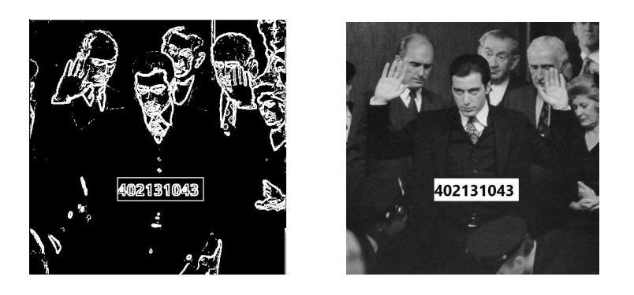

# Edge-Detection with HLS & Verilog

# FPGA Image Filtering Project

This repository contains the implementation of an image processing pipeline on FPGA, focusing on Gaussian blur and Sobel edge detection. The project is built on the Xilinx Zynq architecture using both **Verilog** and **High-Level Synthesis (HLS)**.

## 🔧 Features

- Gaussian Blur filtering using a 3x3 convolution kernel
- Sobel Edge Detection
- Streaming pixel data using buffers between PS and PL
- Verilog and HLS implementations for comparison
- Full testbench and output visualization

## 🧰 Tools & Technologies

- Xilinx Vivado Design Suite
- Verilog HDL
- HLS (C/C++)
- Zynq-based board
- Intel FPGA datasheets for comparison

## 📷 Sample Outputs

- Input Image
- Gaussian Filtered Image
- Sobel Edge Detected Image

## 📚 Reference Links

- [Spatial Filter GitHub Project](https://github.com/vipinkmenon/SpatialFilter)
- [Video Walkthrough](https://www.youtube.com/watch?v=Zm3KzhahbUg&list=PL1tvZA53A9hJnwmiqPt1KeXrAQ9kd52H2)

